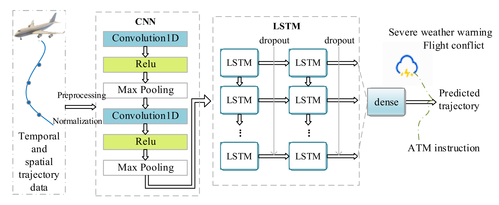

# 4D 航迹预测

> 使用`PyTorch`框架。

### 数据描述

- **input** `batch x feature x sequence`
- **output** `batch x label`
- **feature** `[时间, 经度, 纬度, 速度, 高度, 航向]`
- **label** `[时间, 经度, 纬度, 高度]`
- **sequence** `6个连续的雷达数据`

### 模型

